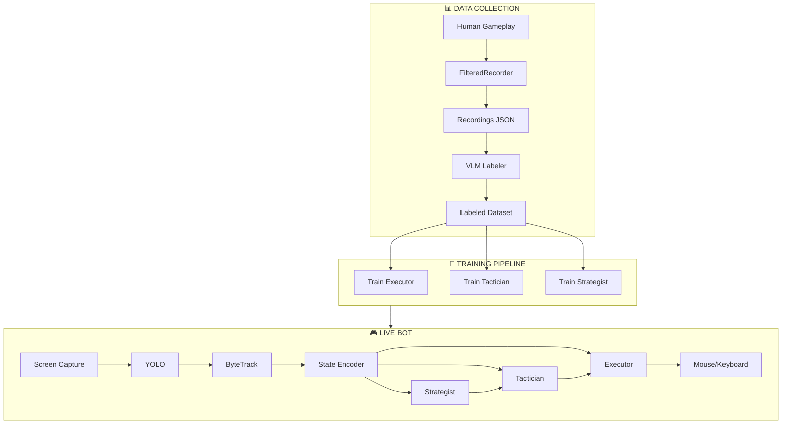
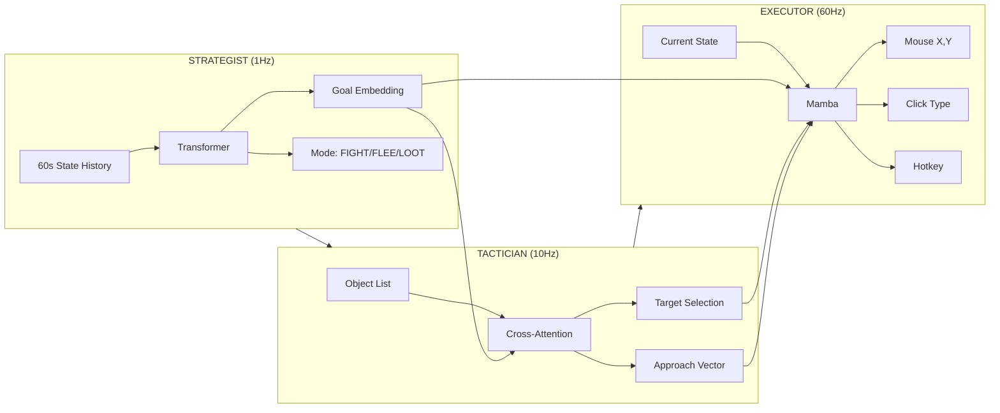
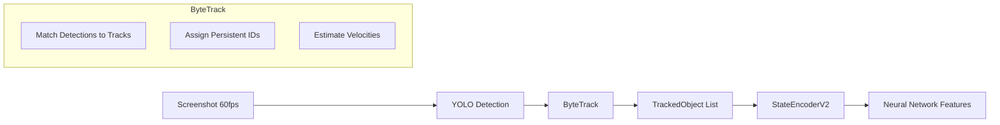
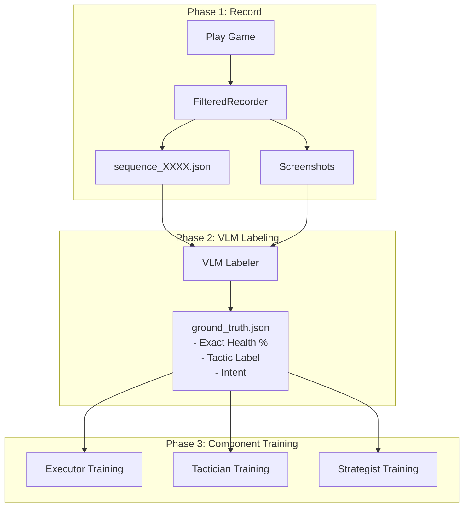
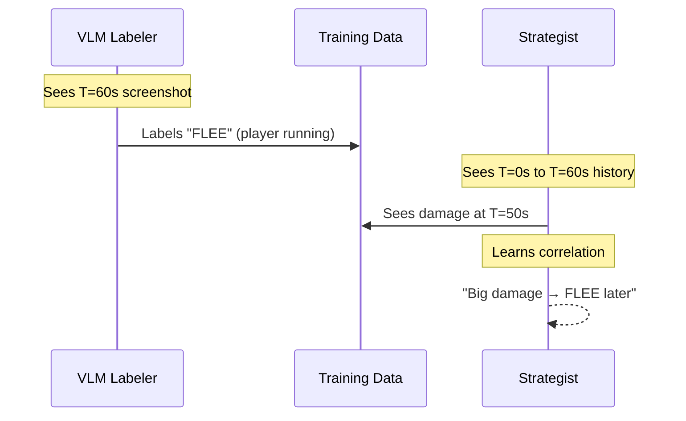
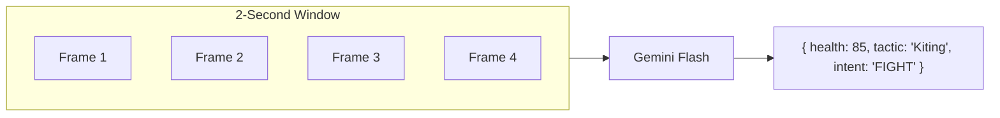

# V2 System Overview - Complete Picture

This document provides a comprehensive, visualization-ready overview of the entire V2 DarkOrbit bot system.

---

## 1. The Big Picture



---

## 2. The Hierarchical Brain

The V2 bot thinks at **three different speeds**:

| Layer | Model | Speed | Responsibility |
|-------|-------|-------|----------------|
| **Strategist** | Transformer | 1 Hz | "What should I be doing?" (FIGHT / FLEE / LOOT) |
| **Tactician** | Cross-Attention | 10 Hz | "Which target?" (Select from detected objects) |
| **Executor** | Mamba/LSTM | 60 Hz | "Exactly where to move mouse, when to click" |



---

## 3. Perception Pipeline

Before any decision-making, we need to **see** the game.



**Key Concept:** ByteTrack gives each object a **persistent ID**.
- Frame 1: Enemy at (0.3, 0.5) → ID: `enemy_001`
- Frame 2: Enemy moves to (0.4, 0.5) → Still `enemy_001`
- Now the bot can "lock on" and track the same enemy across frames.

---

## 4. The Training Pipeline

### 4.1 Data Flow



### 4.2 The Causality Bridge Problem

> "How does a 2-second VLM window understand 10-second consequences?"

**Answer:** It doesn't need to — that's the Strategist's job.



---

## 5. Executor Action Space (Upgraded)

The Executor outputs:

| Output | Type | Values |
|--------|------|--------|
| `mouse_x` | Continuous | 0.0 - 1.0 |
| `mouse_y` | Continuous | 0.0 - 1.0 |
| `click_type` | Discrete (Softmax) | None, Left, Right |
| `hotkey` | Discrete (Softmax) | None, 1-9, Q, E, R, Space, Ctrl... |

This allows the bot to use any ability, not just click.

---

## 6. VLM "Sliding Window" Analysis

Instead of single screenshots, we send **frame sequences** to the VLM.



**Why?** A single frame can't show motion. With multiple frames, VLM can see:
- "Player is circling enemy" → Kiting
- "Player is running toward portal" → Fleeing
- "Player is stationary near boxes" → Looting

---

## 7. Complete System Diagram

```
┌──────────────────────────────────────────────────────────────────────────────┐
│                           V2 BOT RUNTIME                                      │
├──────────────────────────────────────────────────────────────────────────────┤
│                                                                               │
│   ┌─────────────┐    ┌─────────────┐    ┌─────────────┐                      │
│   │   YOLO      │───▶│  ByteTrack  │───▶│   State     │                      │
│   │  (10ms)     │    │   (2ms)     │    │  Encoder    │                      │
│   └─────────────┘    └─────────────┘    └──────┬──────┘                      │
│                                                 │                             │
│         ┌───────────────────────────────────────┼─────────────────────┐      │
│         │                                       │                      │      │
│         ▼                                       ▼                      ▼      │
│   ┌───────────┐                          ┌───────────┐          ┌───────────┐│
│   │STRATEGIST │                          │ TACTICIAN │          │ EXECUTOR  ││
│   │  (1 Hz)   │─────Goal Embedding──────▶│  (10 Hz)  │─Target──▶│  (60 Hz)  ││
│   │Transformer│                          │Cross-Attn │          │   Mamba   ││
│   └───────────┘                          └───────────┘          └─────┬─────┘│
│         │                                                             │      │
│         │ Mode: FIGHT/FLEE/LOOT                                       │      │
│         │                                              ┌──────────────┘      │
│         ▼                                              ▼                     │
│   ┌─────────────────────────────────────────────────────────────────────┐   │
│   │                    HUMANIZED ACTION EXECUTOR                         │   │
│   │                    Bezier curves, variable timing                    │   │
│   └─────────────────────────────────────────────────────────────────────┘   │
│                                      │                                       │
│                                      ▼                                       │
│                            [ Mouse + Keyboard Output ]                       │
│                                                                               │
├──────────────────────────────────────────────────────────────────────────────┤
│                           VLM CRITIQUE (Async, 3s)                           │
│                    "You should have fled, not fought"                        │
│                    Corrections → Retrain All Layers                          │
└──────────────────────────────────────────────────────────────────────────────┘
```

---

## 8. File Map

```
f:\dev\bot\
├── ARCHITECTURE_V2.md          # Technical architecture details
├── TRAINING_WORKFLOW_V2.md     # How to train the system
├── IMPLEMENTATION_PLAN_V2.md   # What needs to be built
├── V2_SYSTEM_OVERVIEW.md       # THIS FILE (Big Picture)
│
└── darkorbit_bot/
    └── v2/
        ├── perception/
        │   ├── tracker.py           # ByteTrack object tracking
        │   └── state_encoder.py     # Feature encoding
        │
        ├── models/
        │   ├── strategist.py        # Transformer (1Hz)
        │   ├── tactician.py         # Cross-Attention (10Hz)
        │   ├── executor.py          # Mamba/LSTM (60Hz)
        │   └── unified.py           # Combined model
        │
        ├── training/
        │   ├── train_executor.py
        │   ├── train_tactician.py
        │   ├── train_strategist.py
        │   └── vlm_labeler.py       # (To be built)
        │
        ├── bot_controller_v2.py     # Main runtime
        └── config.py                # All configuration
```

---

## 9. Summary Table

| Concept | Purpose | Key Tech |
|---------|---------|----------|
| **Hierarchical Temporal** | Different decisions at different speeds | Transformer + Mamba |
| **ByteTrack** | Persistent object IDs across frames | IoU matching |
| **VLM Coach** | Label tactics from video clips | Gemini 1.5 Flash |
| **Sliding Window** | Multi-frame context for VLM | 4-5 frames / 2s |
| **Causality Bridge** | Long-term learning from short-term labels | Strategist 60s history |
| **Complex Actions** | Full hotbar support | Softmax classification |

---

## 10. Next Steps (Implementation Order)

1. ✅ **Architecture Design** — Complete
2. ⬜ **Data Collection Upgrade** — Capture hotkeys in FilteredRecorder
3. ⬜ **Executor Upgrade** — Multi-head output (mouse + click + hotkey)
4. ⬜ **VLM Labeler** — Sliding window + tactical descriptions
5. ⬜ **Train Components** — Executor → Tactician → Strategist
6. ⬜ **Integration** — Connect all layers in bot_controller_v2.py
